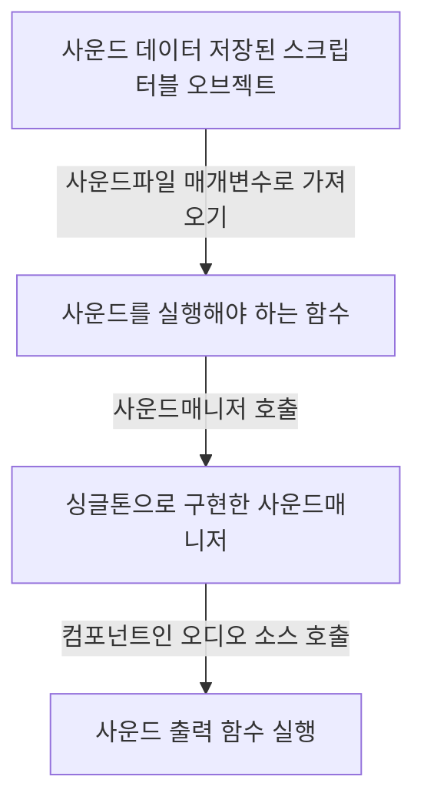

---
상태:
  - 진행중
담당자:
  - 이준호
마일스톤:
  - 기획/설계
카테고리:
  - 시스템
시작 날짜: 2026-01-15
완료 날짜: 2026-01-15
우선순위:
  - 높음
---
## 개요

이 문서에서는 게임 속에서 사운드 시스템을 어떻게 구현할 것인지에 대해 설명한다.

## 구현 방식

```mermaid
graph TD
soundManager[싱글톤으로 구현한 사운드매니저]
soundNeedMethod[사운드를 실행해야 하는 함수] --> |사운드매니저 호출| soundManager
soundData[사운드 데이터 저장된 스크립터블 오브젝트] --> |사운드파일 매개변수로 가져오기| soundNeedMethod
soundManager --> |컴포넌트인 오디오 소스 호출| soundOutputMethod[사운드 출력 함수 실행]
```
