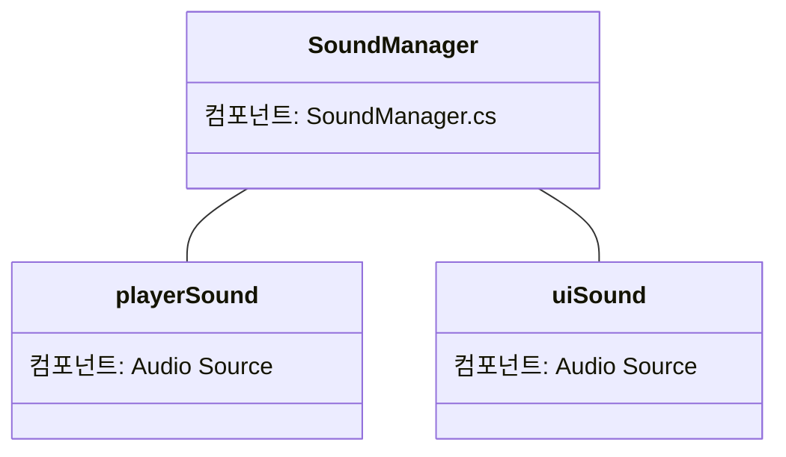

---
상태:
  - 완료
담당자:
  - 이준호
마일스톤:
  - 기획/설계
카테고리:
  - 시스템
시작 날짜: 2026-01-18
완료 날짜: 2026-01-18
우선순위:
  - 높음
---

## 개요

본 문서는 유니티 엔진 환경에서 게임 내 모든 사운드를 중앙에서 관리하는 **SoundManager** 시스템의 기술적 설계 및 구현 명세를 다룬다. 
[[사운드 시스템 기획]]에 명시된 요구사항을 기반으로 작성되었다.

## 시스템 아키텍처

### 핵심 구성 요소

- **SoundManager (Class):** 시스템의 핵심 컨트롤러. 싱글톤 패턴으로 구현되며 `DontDestroyOnLoad`를 통해 씬 전환 시에도 유지된다.
- **SoundData (ScriptableObject):** 사운드 리소스(AudioClip)를 그룹별(BGM, SFX, UI 등)로 관리하는 데이터 컨테이너.
- **AudioMixer (Unity Asset):** 볼륨 그룹(Master, BGM, SFX, UI)을 나누고 볼륨 제어 및 이펙팅을 담당.

| 구성 요소                           | 설명                                                                                                                         |
| ------------------------------- | -------------------------------------------------------------------------------------------------------------------------- |
| **SoundManager(cs 스크립트 파일)**    | 시스템의 핵심 컨트롤러. 싱글톤 패턴으로 구현되며 `DontDestroyOnLoad`를 통해 씬 전환 시에도 삭제되지 않도록 한다.                                                  |
| **SoundData(ScriptableObject)** | 사운드 리소스(AudioClip)을 그룹별로 관리하는 데이터 컨테이너. 스크립터블 오브젝트 내부에는 *데이터를 저장하기 위한 리스트 함수*, *다른 함수에서 데이터를 반환하는 용도의 `public` 메서드*가 필요하다. |
| **AudioMixer(Unity Asset)**     | 논리적 볼륨 그룹^[[[사운드 시스템 기획#사운드의 논리적 그룹]] 부분 참조]에 따라 볼륨을 제어할 수 있도록 하는 기능이다. 유니티 기능을 활용하여 구현한다.                                 |

### `SoundManager` 게임오브젝트 프리팹의 구조

사운드매니저 게임 오브젝트는 아래 다이어그램과 같이 이루어져 있다.

특정 논리적 볼륨 그룹에 따라 추가로 분류되는 옵션이 필요한 경우, `AudioSource` 프리팹을 `SoundManager` 프리팹의 하위 게임오브젝트로 생성하여 구현하도록 한다.