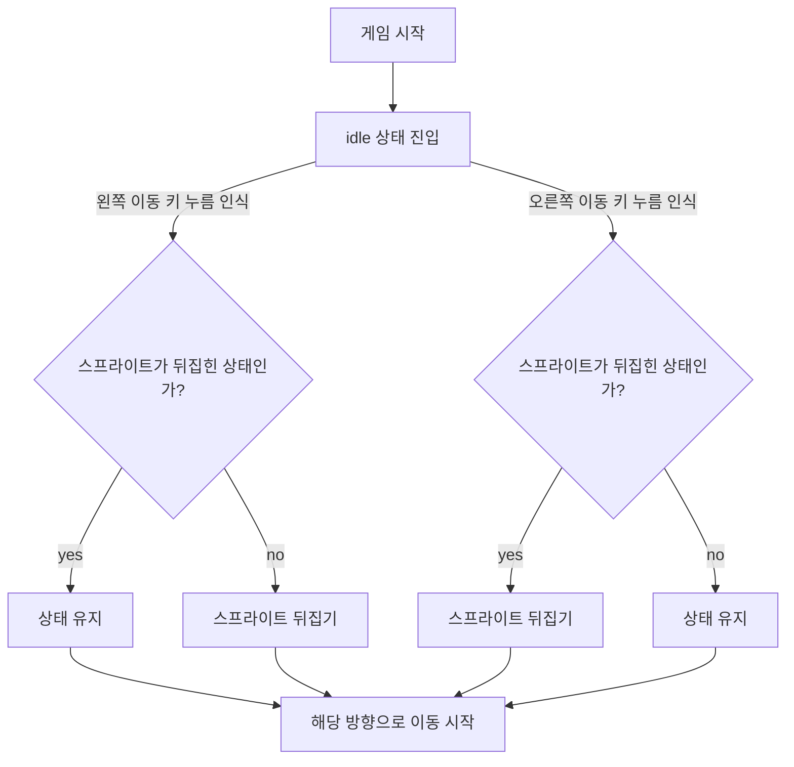
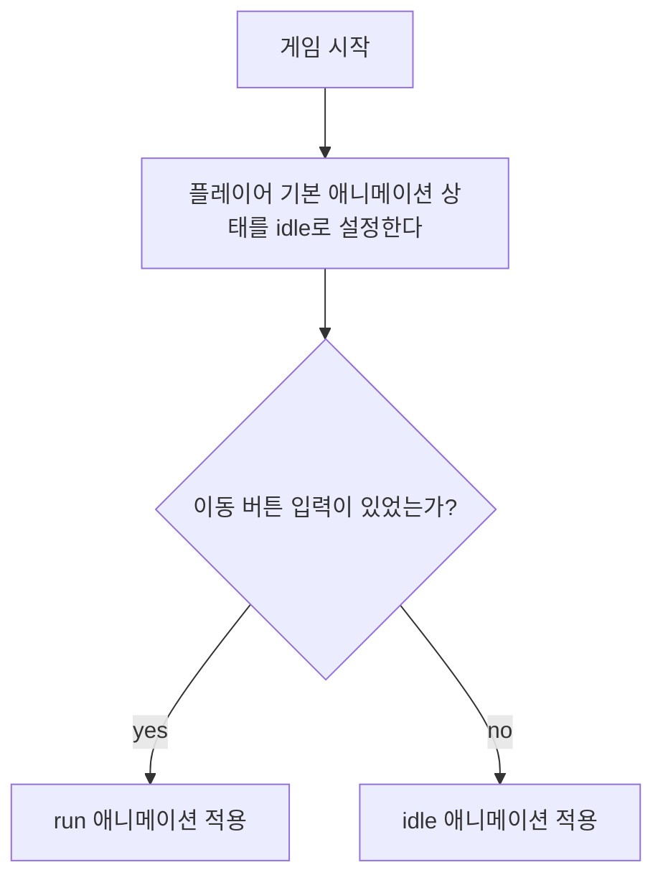

---
상태:
  - 완료
담당자:
  - 이준호
마일스톤:
  - 기획/설계
카테고리:
  - 플레이어
시작 날짜: 2026-01-06
완료 날짜: 2026-01-06
우선순위:
  - 높음
---
# 개요

## 요약

이 문서는 게임 내 플레이어 캐릭터의 기본 스탯, 이동 시스템, 전투 시스템, 사망 및 부활 메커니즘, 레벨 시스템을 포함한 플레이어 관련 모든 기획 요소를 다룹니다.

---

## 주요 특징

- WASD/방향키를 이용한 8방향 자유 이동
- 조작 키가 없는 완전 자동 공격 시스템
- 경험치 기반 레벨업과 랜덤 보상 선택
- 무기/패시브 슬롯 제한을 통한 전략적 빌드 구성
- 특정 조건 충족 시 무기 진화 시스템

---

# 사용할 에셋

## 캐릭터 애니메이션 에셋

> [!tip] 캐릭터 애니메이션 에셋
> - **에셋명**: Free 3 Cyberpunk Sprites Pixel Art
> - **URL:** [https://free-game-assets.itch.io/free-3-cyberpunk-sprites-pixel-art](https://free-game-assets.itch.io/free-3-cyberpunk-sprites-pixel-art) ![[Pasted image 20260108224814.png]]
> - **사용 캐릭터:** 세 캐릭터 중 **핑크색 머리 캐릭터**를 사용한다.

> [!tip] 캐릭터 사운드 에셋
> 아직 구체적인 에셋을 선정하지 못함. (우선순위 낮음)
> 
> **필요한 사운드 목록**:
> - 피격 사운드
> - 레벨업 사운드
> - 사망 사운드
> - 부활 사운드

---

# 기본 스탯

| 스탯       | 유형      | 기본값  | 설명                            |
| :------- | ------- | :--- | :---------------------------- |
| 최대 HP    | `int`   | 100  | 플레이어의 체력. 0이 되면 사망            |
| 방어력      | `int`   | 10   | 받는 피해 감소량                     |
| 체력 회복 속도 | `int`   | 1    | 초당 체력 회복 속도                   |
| 이동 속도    | `float` | 5.0  | 초당 이동 거리                      |
| 획득 범위    | `float` | 3.0  | 경험치 또는 재화 오브젝트 자동 획득 반경       |
| 행운       | `float` | 0.0% | 재화 드롭 확률 증가, 레벨업 선택지 품질 향상    |
| 성장       | `float` | 0.0% | 경험치 획득량 증가                    |
| 탐욕       | `float` | 0.0% | 재화 획득량 증가                     |
| 저주       | `float` | 0.0% | 적의 수와 체력 증가, 대신 경험치와 재화 드롭 증가 |
| 목숨       | `int`   | 1    | 플레이어가 부활할 수 있는 남은 기회          |

> **스탯 변동:** 패시브 아이템을 통해 레벨업 시 선택적으로 강화 가능

---

# 이동 시스템

<iframe width="560" height="315" src="https://www.youtube.com/embed/7gziY8T2UOM?si=wgYCRk6GWWfuexPp" title="YouTube video player" frameborder="0" allow="accelerometer; autoplay; clipboard-write; encrypted-media; gyroscope; picture-in-picture; web-share" referrerpolicy="strict-origin-when-cross-origin" allowfullscreen></iframe>

## 특징 및 조작법

- **조작:** WASD 또는 방향키를 통한 8방향 자유 이동.
- **8방향 이동:** 대각선 방향 이동 가능 (속도는 정규화하여 일정하게 유지).
- **충돌 처리:** 아지트, 포탑 등의 구조물은 통과할 수 없음.
- **주요 조작:** 캐릭터의 주 조작은 이동으로만 제한됨.

---

## 플레이어 이동에 필요한 에셋

> [!note] idle 상태 에셋
> ![[Pasted image 20260108232955.png]]
> 캐릭터 이동 버튼에 입력이 없을 때 적용되는 스프라이트 이미지

> [!NOTE] 달리기 상태 에셋
> ![[Pasted image 20260108233040.png]]
> 캐릭터 이동 버튼에 입력이 있을 때 적용되는 스프라이트 이미지

---

## 플레이어 좌우 반전 조건

플레이어 스프라이트 이미지는 기본적으로 오른쪽을 바라보고 있다.
따라서 스프라이트 이미지가 좌우반전 상태라는 것은 왼쪽을 바라보고 있다는 것을 의미한다.

### 애니메이션 및 스프라이트

---

# 전투 시스템

## 자동 공격

- 플레이어는 직접 공격 조작을 하지 않음.
- 장착한 무기가 각 무기의 '공격 속도' 스탯에 따라 자동으로 발동.
- 무기마다 고유한 타겟팅 방식(가까운 적, 무작위 등)과 발동 방식(투사체, 범위 등)을 가짐.

---

## 피격 시스템

> [!NOTE] '피격'의 정의
> `HP`가 어떠한 방식으로든 줄어드는 상황을 '피격'으로 정의한다.

### 피격 이펙트에 필요한 에셋

- 피격 이펙트
	- ![[Pasted image 20260108235407.png]]
	- 에셋으로 제공되는 플레이어 피격 애니메이션을 사용한다.
- 사운드 이펙트
	- 아직 선정되지 않았다.
	- 우선도가 낮기 때문에 추후 선정하도록 한다.
		- [[할 일 목록.base]]에 추가해둘 예정.

> [!important] 데미지 표시
> 정확한 수치를 보여주는 데미지 텍스트는 따로 표시하지 않는다.
> 감소한 체력량은 UI의 체력 게이지로만 표시한다.
> 피격 이펙트의 목적은 피해를 입었다는 사실을 **직관적으로 알리는 것**이기 때문이다.

### 플레이어에게 적용되는 피해량 계산 공식

최종 피해량은 플레이어의 방어력에 따라 감쇄된다.

> [!note] 공식
> $$\text{최종 피해량} = \text{round} ( \frac{100}{100 + \text{플레이어 방어력}} )$$

![[방어력 별 피해량 감소 비율.png]]
x축은 **플레이어 방어력**이고, y축은 **플레이어가 받는 피해량의 감소율**이다.

---

# 사망 및 부활 시스템

## 플레이어 사망

> [!NOTE] 사망 조건
> 플레이어의 `HP`가 **0 이하**가 되면 사망

> [!NOTE] 사망 시 프로세스
> 1. 플레이어 사망 애니메이션 재생
> 2. 사망 애니메이션 종료 후 플레이어 게임 오브젝트 삭제
> 3. 부활 시스템 작동(`목숨` -1)
> 4. (부활이 가능하다면) 아지트 위치에서 플레이어 재생성

### 플레이어 사망 구현에 필요한 에셋

> [!NOTE] 시각 효과
> 사망 애니메이션으로는 플레이어 에셋으로 제공되는 `Death` 스프라이트 애니메이션을 사용한다. ![[Pasted image 20260109005921.png]]

> [!NOTE] 청각 효과
> 사망 시 사운드 이펙트를 재생한다.
> 
> 다만 아직 캐릭터의 주요 사운드 이펙트 에셋이 준비되지 않았으므로, 이 부분은 바뀔 수 있음을 유의.

> [!warning] 주의할 점
> 플레이어가 사망할 경우, 부활하기 전까지 조작이 불가능해진다.

---

## 부활 시스템

### 부활 매커니즘

- **부활 위치**: 아지트 중앙
- **부활 시간**: 사망 후 5초 뒤 자동 부활
- **부활 시 HP**: 최대 `HP`로 회복
- **무적 시간**: 부활 후 2초간 무적 상태 유지

> [!note] 부활 조건
> 부활은 목숨이 1개 이상인 경우에만 가능하다.
> 
> 목숨이 없는 경우, 플레이어는 **사망**하고, 게임은 **게임 오버**
 단계^[자세한 내용은 [[승리, 패배 시스템]] 문서에서 다룬다.]에 진입한다.

### 플레이어 부활 구현에 필요한 에셋

부활은 자주 일어나고, 플레이어는 곧바로 전투에 참여해야 하기 때문에 부활 애니메이션은 따로 적용하지 않는다.
단, 무적 상태일 경우, 플레이어가 반투명해지는 효과를 유니티 인스펙터로 구현한다.

---

# 레벨 시스템

## 레벨업

| 항목    | 설명         |
| ----- | ---------- |
| 시작 레벨 | 1레벨        |
| 최대 레벨 | $\infty$레벨 |

### 레벨별 필요 경험치

| 레벨 구간   | 비고                                                                                                                                                  |
| ------- | --------------------------------------------------------------------------------------------------------------------------------------------------- |
| 1 ~ 15  | 빠른 성장이 가능한 초반 구간. 초반에는 적을 처치하는 시간이 느리고, 플레이어가 빌드를 만들고 플레이 하는 것도 아니기 때문에 플레이어가 지루함을 느낄 확률이 높다. 따라서 플레이어가 빠르게 이 구간을 벗어날 수 있도록 한다.                  |
| 16 ~ 30 | 이 구간에서 플레이어는 본인이 어떤 빌드를 짜야 할 지를 정하고, 그 빌드를 성장시키게 된다. 이때부터 적 난이도가 상승하므로, 플레이어는 조금 더 조심하면서 아이템 조합을 완성하기 위해 집중해야 한다.                                |
| 31 ~ 50 | 이 구간에 들어선 플레이어는 빌드가 완성되었을 것이다. 따라서 무분별한 레벨업보다는 *컨트롤을 통한 생존*이 강조되도록 선형 증가폭을 더 높인다. 플레이어가 본인의 빌드의 부족한 부분을 메꾸거나, 기존 빌드를 더 강력하게 만들기 위해 노력해야 하는 구간이다. |
| 51 이상   | 이 구간부터는 도전의 영역이다. 따라서 이 구간부터는 제곱 수식을 적용함으로써 경험치 획득량을 크게 늘리도록 한다.                                                                                 |

> [!note] 레벨 구간별 레벨업 요구 경험치 공식
> 여기에서 $L$은 플레이어의 현재 레벨이다.
> $$XP_{req}(L) = \begin{cases} 8L + 10, & \text{if } 1 \le L \le 15 \\15L + 120, & \text{if } 16 \le L \le 30 \\30L + 300, & \text{if } 31 \le L \le 50 \\2L^2 + 500, & \text{if } 51 \leq L \end{cases}$$
> ![[레벨 구간별 요구 경험치.png]]

### 경험치 획득 방법

> [!note] 개요
> 적을 처치하면 **경험치 드롭 아이템**이 확정적으로 생성된다.
> 경험치 드롭 아이템을 획득하면 플레이어의 경험치가 누적된다.

### 적에 따른 경험치 오브 개수

자세한 기획은 [[적 기획]]에서 진행하도록 한다.

| 적 유형 | 드롭하는 경험치 아이템 개수 |
| ---- | --------------- |
| 일반 적 | 1               |
| 정예 적 | 2               |
| 보스   | 4               |

### 경험치 오브젝트에 필요한 에셋

이 에셋은 아직 찾지 못했기 때문에 찾아야 한다. [[할 일 목록.base]]에 추가해둘 예정. 필요한 에셋은 다음과 같다.

- 아이템 생김새
- 획득 사운드

---

## 레벨업 시 변화

### 레벨업 보상 선택지 시스템

- 레벨업 시 3개의 무작위 선택지를 제공한다.
- 10레벨 단위(10, 20, 30레벨 등)에서는 4개의 선택지를 제공한다.
- 선택지 중 하나를 선택해서 보상을 획득한다.

### 선택지 구성 확률

이 부분은 [[무기 아이템 기획]]과 [[패시브 아이템 기획]]이 완료된 후 기획하도록 한다.
무기 변동에 따라 달라질 수 있기 때문이다.

---

## 레벨 관련 시각 이펙트 요소

- **레벨업 순간**: 캐릭터 위에 "LEVEL UP!" 텍스트 + 밝은 섬광 효과
- **선택지 등장**: 카드가 펼쳐지는 듯한 애니메이션
- **보상 선택**: 마우스 커서가 올라간 카드 가장자리에 강조 효과