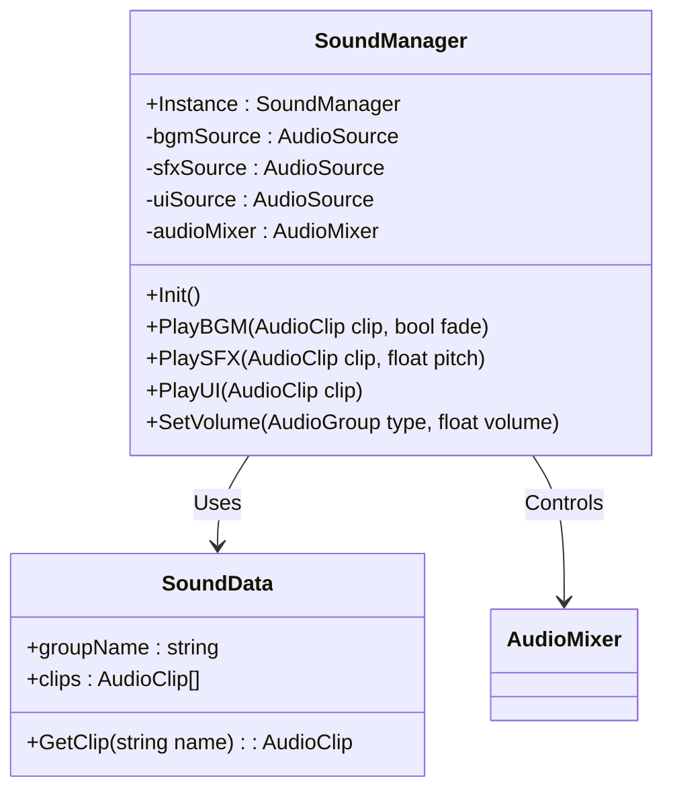

---
상태:
  - 완료
담당자:
  - 이준호
마일스톤:
  - 기획/설계
카테고리:
  - 시스템
시작 날짜: 2026-01-18
완료 날짜: 2026-01-18
우선순위:
  - 높음
---

## 1. 개요

본 문서는 유니티 엔진 환경에서 게임 내 모든 사운드를 중앙에서 관리하는 **SoundManager** 시스템의 기술적 설계 및 구현 명세를 다룬다. 
[사운드 시스템 기획](<../기획서들/이준호/사운드 시스템 기획.md>)에 명시된 요구사항을 기반으로 작성되었다.

## 2. 시스템 아키텍처

### 2.1. 핵심 구성 요소

- **SoundManager (Class):** 시스템의 핵심 컨트롤러. 싱글톤 패턴으로 구현되며 `DontDestroyOnLoad`를 통해 씬 전환 시에도 유지된다.
- **SoundData (ScriptableObject):** 사운드 리소스(AudioClip)를 그룹별(BGM, SFX, UI 등)로 관리하는 데이터 컨테이너.
- **AudioMixer (Unity Asset):** 볼륨 그룹(Master, BGM, SFX, UI)을 나누고 볼륨 제어 및 이펙팅을 담당.

### 2.2. 클래스 다이어그램 (약식)



## 3. 상세 기능 명세

### 3.1. 초기화 (Initialization)

- **싱글톤 보장:** 게임 시작 시 인스턴스가 하나만 존재하도록 보장한다.
- **오디오 소스 설정:** BGM, SFX, UI 등 용도별 `AudioSource` 컴포넌트를 초기화하고 `AudioMixerGroup`을 연결한다.
- **씬 전환 처리:** 씬이 로드될 때 BGM이 유지되거나 변경되는 로직을 처리한다.

### 3.2. 사운드 재생 (Playback)

#### A. BGM (Background Music)

- **Looping:** 기본적으로 반복 재생으로 설정한다.
- **Cross-fade:** BGM 변경 시 이전 곡은 서서히 줄어들고(Fade-out), 새 곡은 서서히 커지는(Fade-in) 코루틴을 구현하여 자연스러운 전환을 유도한다.
- **제어:** `PlayBGM`, `StopBGM`, `PauseBGM` 등의 메서드 제공.

#### B. SFX (Sound Effects - 2D/Mono)

- **대상:** UI 클릭음, 전체 알림음, 캐릭터 피격음(화면 전체 효과) 등 위치값이 중요하지 않은 사운드.
- **방식:** `PlayOneShot`을 사용하여 하나의 AudioSource에서 여러 소리가 겹쳐 들릴 수 있도록 한다.
- **Pitch 변주:** 반복적인 효과음(예: 총소리)의 기계적인 느낌을 덜기 위해 Pitch(음높이)를 랜덤하게 미세 조정하는 옵션을 제공한다.

#### C. 3D Spatial Sound (공간 음향)

- **관리 주체:** `SoundManager`가 직접 재생하지 않고, 각 개별 객체(적, 투사체 등)가 자체 `AudioSource`를 가진다.
- **연동:** 단, 각 객체의 `AudioSource` 출력은 `SoundManager`가 관리하는 `AudioMixer`의 **SFX Group**으로 라우팅되어야 한다.

### 3.3. 볼륨 제어 (Volume Control)

- **AudioMixer 연동:** 유니티 `AudioMixer`의 파라미터를 노출하여 스크립트에서 제어한다.
- **Logarithmic Scale:** 데시벨(dB) 단위인 AudioMixer 특성에 맞춰, 슬라이더 값(0~1)을 로그 스케일(-80dB ~ 0dB)로 변환하여 적용한다.
  > 공식: `Mathf.Log10(volume) * 20`
- **구분:** Master, BGM, SFX, UI 4가지 채널로 분리하여 제어한다.

## 4. 데이터 구조 (SoundData ScriptableObject)

리소스 관리를 효율적으로 하기 위해 `ScriptableObject`를 사용한다.

```csharp
[CreateAssetMenu(fileName = "New Sound Data", menuName = "Sound System/Sound Data")]
public class SoundData : ScriptableObject
{
    public string dataId; // 데이터 식별자 (예: PlayerWeapon, GlobalUI)
    public AudioClip[] clips; // 오디오 클립 배열

    // 이름으로 클립을 찾는 헬퍼 메서드
    public AudioClip GetClip(string name)
    {
        // 딕셔너리 캐싱 또는 선형 탐색 구현
    }
}
```

## 5. 구현 가이드라인

### 5.1. SoundManager 프리팹 구조

```text
SoundManager (GameObject, DontDestroyOnLoad)
 ├── Script: SoundManager.cs
 ├── AudioSource (BGM) -> Output: Mixer/BGM
 ├── AudioSource (SFX) -> Output: Mixer/SFX
 └── AudioSource (UI)  -> Output: Mixer/UI
```

### 5.2. 외부 스크립트 사용 예시

```csharp
// UI 버튼 클릭 시
public void OnClickButton() {
    SoundManager.Instance.PlayUI(clickSoundClip);
}

// BGM 변경 시
SoundManager.Instance.PlayBGM(stageBgmClip, fadeDuration: 1.0f);
```

## 6. 에셋 요구사항

- **AudioMixer:** `MainMixer` 생성 및 Master, BGM, SFX, UI 그룹핑 필요.
- **SoundData:** 카테고리별(무기, UI, 배경음 등) 에셋 생성 필요.

## 7. 최적화 고려사항 (Optimization)

- **Object Pooling:** 빈번하게 생성/파괴되는 3D 사운드(예: 탄피 떨어지는 소리)의 경우, 오디오 소스가 달린 프리팹을 매번 Instantiate 하지 않고 풀링하여 사용한다.
- **압축 설정:** BGM은 `Streaming`, 짧은 SFX는 `Decompress On Load`, 긴 SFX는 `Compressed In Memory` 등 AudioClip의 Import Settings를 최적화한다.
